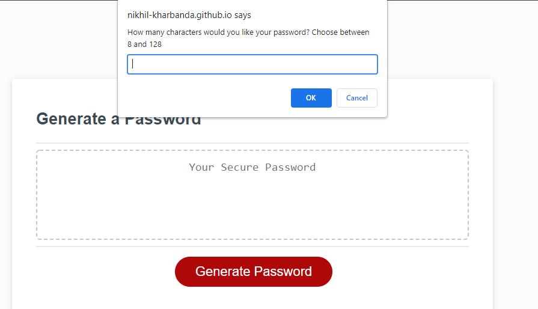

Name: Nikhil Kharbanda
Project: Code Generator
Due: September 17, 2021

In this assignment, I had made a password generator. 
The user clicks the "Generate password" button to start the program, in which case the program will ask the user a series of questions.

It will:
1. Ask the user how many characters they want in their password. It has to be in a valid range of 8-128.
2. Ask the user what kind of characters they want in their password (eg. lowercase, uppercase, special characters, numbers)
3. After which, the password generator site will display the user a new suggested password

Checklist:\
[X] Application presents a series of promts for password criteria\
[X] User selects what criteria the password needs to meet \
[X] When instructed for length of password, only a value of 8 to 128 accepted)\
[X] User selects if they want upper, lower, special, number characters\
[X] User must select one type must be selected\
[X] Password with users chosen criteria generated and displayed on the webpage\
[X] Created a live link on GitHUB

This screenshot shows the interface asking the user to insert a password length

